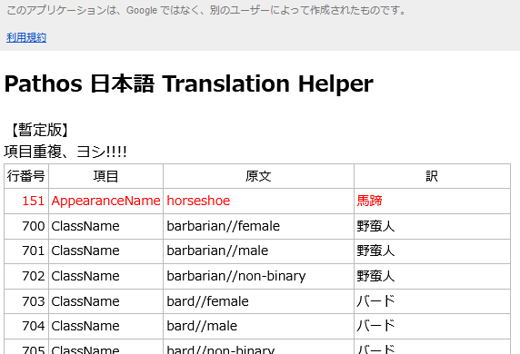
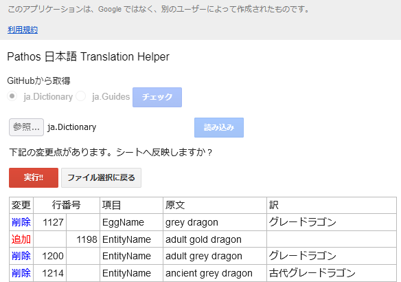
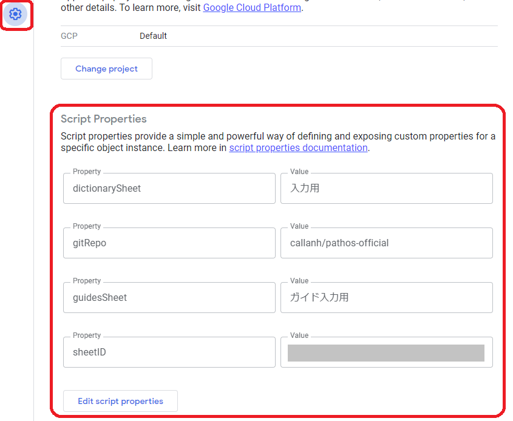

# Pathos Translation Helper

Hail translators!<br>
This helps Google Spreadsheet workflow for Pathos NetHack Codec translators.

## Features
- Generates Dictionary and Guides file and enables to download.
- Generated files are selectable between fully modified translation,<br>
  line number mode, or provisional mode.<br>
  In line number mode, append line number for each translated word.<br>
  In provisional mode, files are filled only when blank lines, not modified existing lines.
- Checks duplicate translations within the same concepts.<br>
  AppearanceName and ItemName are judged as the same concepts.<br>
  
- Semi-auto import function for Dictionary and Guides files.<br>
  Can check changes from both files or the official GitHub repository.<br>
  Deleted lines are not removed from spreadsheet automatically for safety, only changed background color.<br>
  

## How To Setup

### 1. Ready your spreadsheet
The spreadsheet must have sheets;
- which has the header line as line 1.
- which has the first 5 columns represents
  - Column A: row number (embedding function =row()-1 is useful)
  - Column B: concept (ex. AppearanceName)
  - Column C: original words
  - Column D: translated words (before modified)
  - Column E: translated words (after modified)

  The sheet can have columns for progress management or discussions right from column E.

### 2. Install clasp (requires Node.js and npm environment)
```
npm install -g @google/clasp
```

### 3. Clone this repository
```
git clone https://github.com/h1data/pathos-translation-helper
```

### 4. Install google script helper from npm
```
npm install
```

### 5. Create Google Apps Script project
First, you have to log in clasp CLI by your Google account.
```
clasp login
```
Create as a Web App project with clasp CLI.
```
clasp create
```

Or you can create it in Google Apps Script WEB editor. https://script.google.com/<br>
And then fetch the local directory to the WEB project.
```
clasp clone [your script ID]
```

### 6. Configure script properties

In Google Apps Script web editor, enter your project and press the edit icon (gear wheel), and add script properties.
- dictionarySheet: sheet name for contents of dictionary file in your spreadsheet.
- gitRepo: GitHub repository path.
- guidesSheet: sheet name for contents of guides file in your spreadsheet.
- sheetID: sheet ID of your spreadsheet. You can see it in URL of spreadsheet like below.<br>
`https://docs.google.com/spreadsheets/d/[your sheet ID]/edit#gid=xxxxx`



### 7. Tune scripts
At least, you have to modify scripts/variables.js for translation filenames of your language.
```JavaScript
// file names
const dictionaryFileName = 'ja.Dictionary';
const guidesFileName = 'ja.Guides';
```

### 8. Deploy scripts as Web Service
```
clasp push
clasp deploy -d [your deploy id]
```

### 9. Add embed links of the script to the spreadsheet
- File downloader<br>
`https://script.google.com/macros/s/[your deployment id/exec/download/[fileType]?provisional=false&numbered=false`<br>
[fileType]: `dictionary` or `guides`<br>
provisional: if true, check with provisional mode; the original words (column C) have priority. False if not specified.<br>
numbered: if true, append line number to translated texts. Only for dictionary file. It is useful to confirm which line is used in the game. False if not specified.

- Duplicate checker<br>
`https://script.google.com/macros/s/[your deployment id]/exec/check?provisional=false`<br>
provisional: if true, check with provisional mode; the original words (column C) have priority. False if not specified.

- File importer<br>
`https://script.google.com/macros/s/[your deployment id]/exec/import`

## Miscellaneous info
- [Pathos NetHack Codec](https://pathos.azurewebsites.net/)
- Portions of this page are reproduced from work created and
[shared by Google](https://developers.google.com/terms/site-policies)<br>
and used according to terms described in the [Creative Commons 4.0 Attribution License](https://creativecommons.org/licenses/by/4.0/). 
